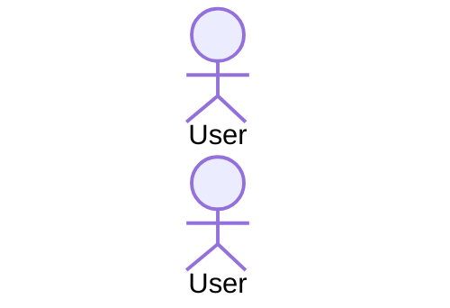

# Solution Diagrams — <PBI ID>

This document details the diagrams of the proposed solution to understand the implementation.

---

## 1. Sequence Diagram (Mandatory)

Shows the sequence flow of the solution being specified, illustrating the interaction between actors, controllers, services, repositories, and external systems.



---

## 2. Class Diagram (Mandatory)

Shows the classes, interfaces, attributes, and methods involved in the solution and their relationships.

```mermaid
classDiagram
    %% Add class diagram elements here
    %% Example:
    %% class Controller {
    %%     +Get()
    %% }
    %% class Service {
    %%     +Execute()
    %% }
    %% Controller --> Service
```

---

## 3. Additional Useful Diagram (Optional / Space for other diagram)

Use this space to add another diagram that helps understand the solution to implement (e.g., State Diagram, Flowchart, Component Diagram, C4 Model, Entity Relationship, etc.).

```mermaid
%% Add other useful diagram here (e.g. stateDiagram-v2, flowchart TD, etc.)
%% Example:
%% flowchart TD
%%     A[Start] --> B(Process)
%%     B --> C{Decision}
```
